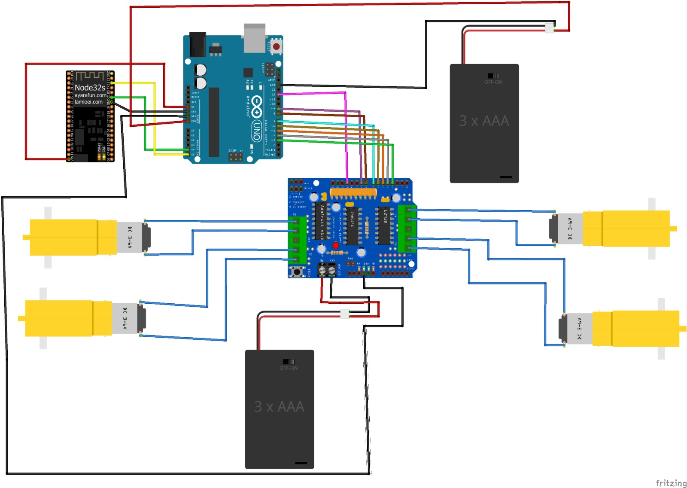

# 4WD-Omni-directional-Mobile-Robot
# Mecanum Mobile Robot (ROS 2 + ESP32 + Arduino UNO + Gazebo/RViz)

This project implements a full workflow for a 4‑mecanum wheeled robot:

- Teleoperation in **ROS 2** (`geometry_msgs/Twist`)
- **Mecanum inverse kinematics** (Twist → 4 wheel speeds)
- Real robot control over Wi‑Fi: **ROS 2 → TCP (JSON) → ESP32 → UART → Arduino UNO → Motor Driver → Motors**
- Gazebo Classic simulation + RViz2 visualization
- Optional MPU‑6500 on ESP32 for roll/pitch/yaw visualization

> The system is **open‑loop** (no wheel encoders). In parallel mode, Gazebo and the real robot follow the *same teleop commands*; perfect real-world position matching is not expected without sensors.

---

## Hardware Schematic




---

## Architecture

### Real Robot Control Path
1. A teleop node publishes `Twist` (commonly on `/cmd_vel`).
2. A ROS 2 bridge node subscribes to the teleop Twist topic and computes mecanum wheel speeds.
3. The bridge sends newline‑delimited JSON frames to the ESP32 (TCP port 5000).
4. ESP32 forwards wheel commands to Arduino UNO via UART.
5. Arduino UNO drives the motor driver.

### Simulation Path
- Gazebo listens to `/cmd_vel` (or a remapped teleop topic) and moves the simulated base.
- RViz visualizes the robot model using TF and optional joint states.

---

## Data Protocol (ROS → ESP32)

The bridge sends one JSON object per line:

```json
{"u":"pwm","w":[p1,p2,p3,p4],"t":1700000000.123} 
```
- `u`: `"pwm"` or `"radps"`
- `w`: wheel array `[FL, FR, RL, RR]`
- `t`: unix timestamp (seconds)

## Requirements

### PC
- Ubuntu 22.04
- ROS 2 Humble
- Gazebo Classic + `gazebo_ros`
- RViz2

### ESP32 (Arduino IDE)
- ESP32 core by Espressif
- Libraries:
  - `ArduinoJson`
  - `WiFi`
  - `Wire`

### Arduino UNO
- Arduino IDE
- `SoftwareSerial` recommended (so you can keep USB Serial for debugging)

---

## Wiring Notes (Important)

### ESP32 ↔ Arduino UNO (Recommended: UART one‑way)
- ESP32 **TX2 (GPIO17)** → UNO **RX** (e.g., D10 using SoftwareSerial)
- ESP32 **GND** ↔ UNO **GND**

Avoid UNO TX → ESP32 RX unless you add level shifting (UNO TX is 5V logic).

### MPU‑6500 ↔ ESP32 (I2C at 3.3V)
- MPU VCC → ESP32 **3V3**
- MPU GND → ESP32 GND
- MPU SDA → ESP32 GPIO21
- MPU SCL → ESP32 GPIO22
- MPU AD0 → GND (0x68) or 3V3 (0x69)

Do **not** pull I2C to 5V when ESP32 is connected.

---

## ROS 2 Build (ament_cmake)

Build the workspace and source it:

```bash
cd ~/ros2_ws
source /opt/ros/humble/setup.bash
colcon build
source install/setup.bash
```
## Build the package:
```bash
colcon build --packages-select mecanum_bot
source install/setup.bash
```
## Running the Sytem:
### 1) Flash Firmware:
- ESP32: TCP wheel receiver + I2C sender to Arduino UNO (+ optional MPU‑6500)
- Arduino UNO: I2C slave receiver + motor control
Open ESP32 Serial Monitor and note:
- ESP32 IP address
- `TCP server started on port 5000`

## wiring Notes (ESP32 ↔ Arduino UNO using I2C):
### I2C Wiring
- ESP32 SDA (GPIO21) → Arduino UNO SDA (A4)
- ESP32 SCL (GPIO22) → Arduino UNO SCL (A5)
- ESP32 GND ↔ Arduino UNO GND (mandatory)

## Real Robot Only (Teleop → ESP32 → UNO)
### Terminal 1 — ROS bridge node (ROS → ESP32)
```bash
source /opt/ros/humble/setup.bash
source ~/ros2_ws/install/setup.bash

ros2 run mecanum_bot teleop_twist_to_esp32_with_gazebo_follower --ros-args \
  -p teleop_topic:=/cmd_vel \
  -p esp32_ip:=172.30.101.xxx \
  -p port:=5000 \
  -p send_mode:=pwm \
  -p dry_run:=false
  ```
 > Note: You can run the Node directly from VS code terminal (or from "run" button but make sure of the data entry inside the code)
  ### Terminal 2 — Teleop
  install if needed
```bash
sudo apt install ros-humble-teleop-twist-keyboard
```
Run:
```bash
ros2 run teleop_twist_keyboard teleop_twist_keyboard
```
Verify teleop is publishing:
```bash
ros2 topic echo /cmd_vel
```
## Gazebo Simulation
### Terminal 1 — Launch Gazebo simulation
```bash
source /opt/ros/humble/setup.bash
source ~/ros2_ws/install/setup.bash

ros2 launch mecanum_bot simulation.launch.py
```

### Terminal 2 — Teleop
```bash
ros2 run teleop_twist_keyboard teleop_twist_keyboard
```

## Real Robot + Gazebo in Parallel 
This runs Gazebo and the real robot at the same time. Both follow the same /cmd_vel stream.
### Terminal 1 — Gazebo simulation
```bash
source /opt/ros/humble/setup.bash
source ~/ros2_ws/install/setup.bash

ros2 launch mecanum_bot simulation.launch.py
```
### Terminal 2 — ROS bridge to ESP32 (real robot)
```bash
source /opt/ros/humble/setup.bash
source ~/ros2_ws/install/setup.bash

ros2 run mecanum_bot teleop_twist_to_esp32_with_gazebo_follower --ros-args \
  -p teleop_topic:=/cmd_vel \
  -p esp32_ip:=172.30.101.xxx \
  -p port:=5000 \
  -p send_mode:=pwm \
  -p dry_run:=false
  ```
  ### Terminal 3 — Teleop
```bash
source /opt/ros/humble/setup.bash
source ~/ros2_ws/install/setup.bash

ros2 run teleop_twist_keyboard teleop_twist_keyboard
```
Now:
- Gazebo moves because it subscribes to `/cmd_vel`
- The real robot moves because the bridge subscribes to `/cmd_vel` and sends wheel JSON to ESP32

### Important Notes
> To perform the mecanum robot movements via `teleop_twist_keyboard` you have to hold `shift` while pressing movement buttons with the keyboard
> You can find the movement instructions in the terminal once you subscribed to `teleop_twist_keyboard` node.

 ## Troubleshooting
 ### Bridge prints correct JSON in `dry_run:=true` but robot does not move
 - ESP32 might not be running the TCP receiver firmware (for example, an HTTP-only sketch).
 - Test connectivity:
```bash
nc 172.30.101.xxx 5000
```
 - The bridge must log:
   - `Connected to ESP32 at ...:5000`

### I2C failed between ESP32 and UNO
- Confirm common GND between ESP32 and UNO.
- Keep SDA/SCL wires short and away from motor wires.
- Reduce I2C speed (ESP32 side): try 50 kHz or 10 kHz.
- Ensure I2C pullups are not to 5V (ESP32 is not 5V tolerant).
- Ensure UNO is configured as an I2C slave at address 0x08.

### wheels are always Zero
- The bridge is not receiving teleop commands or the topic name is wrong.
- Verify:
```bash
ros2 topic echo /cmd_vel
```
## Gazebo does not respond to teleop
- Ensure Gazebo listens to the same topic teleop publishes (default is `/cmd_vel`).
- Verify:
```bash
ros2 topic echo /cmd_vel
```


